# PokeAPI データ取得アプリケーション

[PokeAPI](https://pokeapi.co/)から収集したデータをストレージに保存して DB へ保存する一連のサーバーレスアプリケーションのモノリポジトリ

このアプリケーションは以下の機能を実施することができる

- PokeAPI からデータを取得し、`Cloud Storage`へファイルとして保存する
- `Cloud Storage`に保存されたファイルの複数ファイルを 1 つのファイルに結合したり、`CloudSQL for Postgres`へ取り込むための形式に変換する
- `Cloud Storage`に保存されたファイルを`CloudSQL for Postgres`へ取り込む
- `CloudSQL for Postgres`のスキーマをコードで管理する
- 一連のジョブをワークフローとして管理し、冪等性が確保されている
  - ワークフローツールをいくつか検討したが、コストに見合わないため一旦ローカルでの管理とする

Postgres へロードするときは、`notebook`ディレクトリに以下の要領で`.env`ファイルを作成してください

```
DB_HOST=<HOST IP>
DB_USER=<USERNAME>
DB_PASS=<PASSWORD>
DB_NAME=<DATABASE NAME>
DB_PORT=<DATABASE PORT>
```

以下はアーキテクチャの概要図です。


